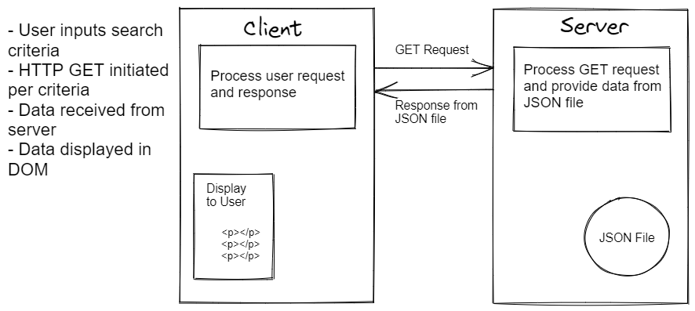
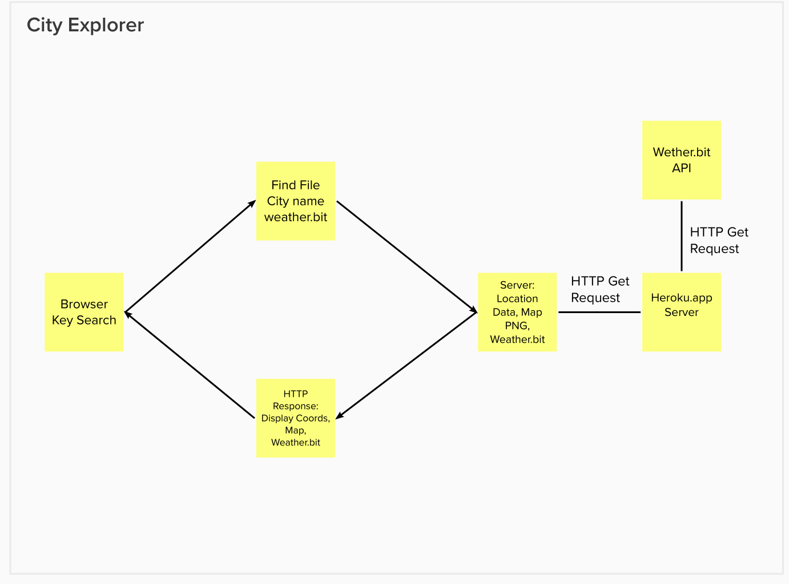

# City Explorer API

**Author**: Chris Fanucchi
**Version**: 1.2.0

## Overview

A web back-end server for providing data to other servers for fronts-end development.

## Getting Started

This app can be copied and used, but knowledge of the hardcoded APIs is required.

## Architecture

This app uses JavaScript and Node.js to handle the back-end processing.

## Change Log

09-27-2022 14:45 - Setup initial files and file structure for app.

## Credit and Collaborations

Worked with Mehtab Riar, Erik Dobb, and Ian Forrester on http request cycle process diagrams.

## Feature Addition Tracking

1. Name of feature: Initial setup and coding
   Estimate of time needed to complete: 2.5 hours
   Start time: 14:45
   Finish time: 16:45
   Actual time needed to complete: 2 hours

2. Name of feature: Get API weather data from external server
   Estimate of time needed to complete: 1.5 hours
   Start time: 15:30
   Finish time: 17:00
   Actual time needed to complete: 1.5 hours
